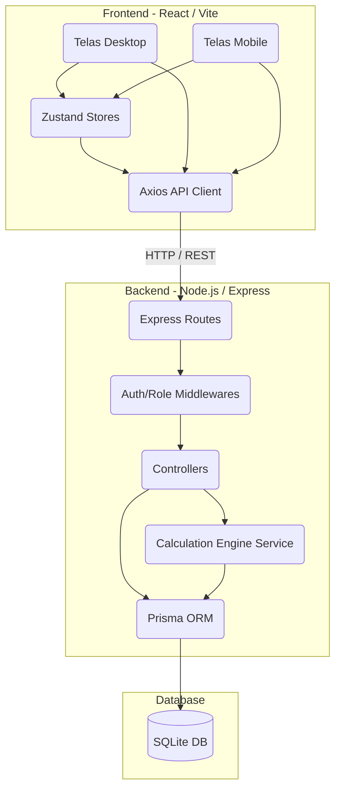
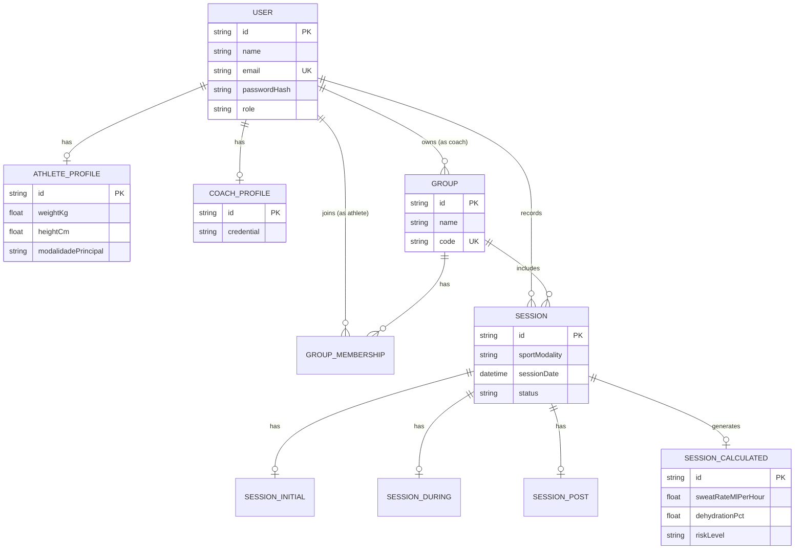

# Nutri Esportiva - Monitoramento Científico de Hidratação

O **Nutri Esportiva** é uma plataforma avançada de monitoramento clínico e fisiológico voltada para a gestão da hidratação e reposição de eletrólitos em atletas de alto rendimento. A solução é dividida em duas interfaces principais: um painel de controle (Dashboard) web para treinadores/profissionais de saúde, e um aplicativo móvel voltado para a coleta de dados diretamente com os atletas durante suas sessões de treinamento (pré, durante e pós-treino).

Através de cálculos automatizados baseados em equações metabólicas e fisiológicas, o sistema avalia continuamente a taxa de sudorese, a perda de peso corporal, a necessidade de reposição de fluidos e o risco eletrolítico de cada atleta. Isso permite intervenções em tempo real para prevenir quadros de desidratação severa, cãibras, hipertermia ou hiponatremia.

A arquitetura do projeto utiliza um modelo cliente-servidor robusto, integrando um backend em Node.js com TypeScript e Prisma ORM para a gestão de dados, e um frontend moderno construído com React, Vite, Zustand e TailwindCSS, com rotas adaptativas para visualização em Desktop e Mobile.

## 2. Objetivo

**O Problema que o sistema resolve:**  
Na prática esportiva de alto rendimento, a desidratação e o desequilíbrio eletrolítico são os principais causadores de quedas de performance, lesões musculares (cãibras) e problemas clínicos agudos (como insolação ou choque térmico). Historicamente, calcular a taxa de sudorese e planejar a hidratação correta é um processo manual, sujeito a erros e planilhas complexas, dificultando o acompanhamento de grupos grandes.

**Público-alvo:**  
- **Treinadores e Fisiologistas:** Que necessitam acompanhar múltiplos atletas simultaneamente, analisar métricas fisiológicas em dashboards visuais e receber alertas emergenciais.
- **Atletas de Alta Performance:** Praticantes de corrida, ciclismo, natação e futebol que precisam monitorar suas métricas diárias, receber recomendações precisas de ingestão de fluidos e logar suas atividades diárias.

**Benefícios da solução:**  
- **Prevenção de Lesões e Risco Clínico:** Alertas automáticos classificando atletas em faixas de risco ("Baixo", "Moderado", "Alto", "Crítico").
- **Agilidade e Precisão:** Substitui planilhas manuais pelo motor de cálculo `calculation.engine.ts` que determina a taxa de sudorese em L/h instantaneamente.
- **Gestão Centralizada:** Permite ao treinador administrar grupos ("Squads") e acompanhar gráficos de evolução histórica diretamente em uma interface unificada.

## 3. Funcionalidades

| Funcionalidade | Descrição |
| --- | --- |
| **Gestão de Grupos (Squads)** | Criação de grupos por treinadores com geração de códigos únicos (ex: `HID-XXXX`) para convite de atletas. |
| **Perfil Fisiológico** | Cadastro de características do atleta (peso, altura, histórico de cãibras, marcas de suor) e avaliação de eletrólitos. |
| **Registro de Sessão Pré-Treino** | Coleta do peso inicial e coloração da urina (escala de Armstrong) para determinar hipoidratação prévia. |
| **Registro de Sessão Intra e Pós-Treino** | Inserção de líquidos consumidos, peso pós-treino, percepção de esforço (Borg) e relato de sintomas (náusea, dor de cabeça, tontura). |
| **Motor de Cálculo (Calculation Engine)** | Processamento da taxa de sudorese (L/h), % de desidratação, nível de risco fisiológico e prescrição do volume de reidratação necessário. |
| **Triagem de Risco e Alertas** | Tela dedicada para treinadores visualizarem alertas automáticos ("Crítico" ou "Atenção") com recomendações baseadas no estado do atleta. |
| **Dashboard e Gráficos Dinâmicos** | Geração de gráficos em SVG dinâmicos sobre a evolução histórica da taxa de sudorese e distribuição de treinos por modalidade. |
| **Notificações Inteligentes (Dropdown)** | Um sistema de notificações em tempo real na barra superior que alerta treinadores sobre riscos emergenciais nos atletas, os direcionando aos detalhes com um clique. |
| **Controle de Acesso Autenticado** | Autenticação baseada em JWT com controle de roles (`coach` ou `athlete`) blindando rotas e painéis. |

## 4. Tecnologias Utilizadas

| Tecnologia | Finalidade |
| --- | --- |
| **React 19** | Biblioteca principal para a construção das interfaces de usuário do frontend. |
| **Vite** | Ferramenta de build incrivelmente rápida para a aplicação React. |
| **TailwindCSS 4** | Framework de estilização por classes utilitárias para a criação de um design visual moderno, dinâmico e responsivo. |
| **Zustand** | Gerenciador de estado global minimalista, utilizado para o estado de autenticação (`authStore`) e dados dinâmicos. |
| **Lucide React** | Biblioteca de ícones elegantes e personalizáveis em SVG. |
| **React Router Dom** | Roteamento client-side para navegação SPA (Desktop e Mobile). |
| **Node.js & Express** | Plataforma e microframework utilizados para rotear e processar requisições HTTP do lado do servidor. |
| **TypeScript** | Adiciona tipagem estática tanto no backend quanto no frontend (onde aplicável) prevenindo erros em tempo de execução. |
| **Prisma ORM** | Ferramenta de mapeamento objeto-relacional para modelagem do banco de dados, migrações e consultas assíncronas type-safe. |
| **SQLite** | Banco de dados relacional leve (embutido) ideal para desenvolvimento e provas de conceito (`dev.db`). |
| **JWT (JSON Web Token)** | Para segurança das requisições privadas (Auth e Role-based Authorization). |
| **Bcryptjs** | Criptografia (hashing) segura das senhas dos usuários no banco de dados. |

## 5. Arquitetura do Projeto

O projeto adota uma arquitetura Cliente-Servidor no padrão Monorepo lógico (Front e Back isolados, mas versionados juntos). 
- O **Frontend** implementa o padrão "Feature-based / Screen-based" dividindo as interfaces claramente em `desktop` e `mobile`, e utilizando Stores (Zustand) para o state global.
- O **Backend** utiliza uma arquitetura clássica baseada no padrão MVC (Model-View-Controller) simplificado via API REST: Rotas (Router) → Controladores (Controllers) → Lógica de Domínio (Services) → Acesso a Dados (Prisma).



## 6. Estrutura de Pastas

```text
nutri-esportiva/
├── backend/                       # Código-fonte do servidor Node.js
│   ├── prisma/                    # Schema de banco de dados e arquivos de Seed
│   │   ├── schema.prisma          # Modelagem de todas as entidades
│   │   └── seed.ts                # Popula o banco com dados de mock
│   ├── src/
│   │   ├── config/                # Variáveis de ambiente e conexão Prisma
│   │   ├── controllers/           # Lógica de controle das rotas HTTP
│   │   ├── middlewares/           # Interceptores de Autenticação e Perfis
│   │   ├── routes/                # Definição dos endpoints REST
│   │   ├── services/              # Regras de negócios (ex: calculation.engine.ts)
│   │   ├── app.ts                 # Configuração do aplicativo Express
│   │   └── server.ts              # Entry-point (porta 3000)
│   └── package.json
├── src/                           # Código-fonte do frontend React
│   ├── components/                # Componentes reutilizáveis de UI
│   │   ├── desktop/               # TopBar, Sidebar (específicos desktop)
│   │   └── mobile/                # BottomNav (específicos mobile)
│   ├── hooks/                     # Custom hooks (ex: usePlatform)
│   ├── routes/                    # Roteadores Desktop e Mobile
│   ├── screens/                   # Telas da aplicação (Views principais)
│   │   ├── desktop/               # Dashboard, Relatorio, Triagem, etc.
│   │   └── mobile/                # Telas do atleta (Pre/Durante/Pos Sessão)
│   ├── services/                  # Configuração do Axios (api.js)
│   ├── store/                     # Estados Globais via Zustand
│   ├── App.jsx                    # Gerenciador raiz e wrapper de rotas
│   ├── main.jsx                   # Entry-point React DOM
│   └── index.css                  # Estilos globais TailwindCSS
├── package.json                   # Dependências do frontend
└── vite.config.js                 # Configuração de build do Vite
```

## 7. Banco de Dados

O banco de dados relacional foi modelado via **Prisma ORM** e armazena os dados no arquivo `dev.db` (SQLite). Todas as chaves primárias utilizam o formato UUID. O banco é altamente normalizado com relacionamento forte por restrição de foreign keys (`onDelete: Cascade`).



## 8. Fluxo de Funcionamento

1. **Autenticação:** O usuário (Treinador ou Atleta) acessa a tela de Login. A requisição vai ao `auth.controller.ts` que valida a senha contra o hash do `bcryptjs` e emite um token JWT que é guardado no `authStore` do frontend.
2. **Rota Adaptativa:** Baseado no layout atual e na ROLE do usuário, ele é direcionado (O Treinador vê Desktop Dashboards, o Atleta vê Mobile Views).
3. **Registro Fisiológico (Atleta):** 
   - O atleta inicia a `Sessão` informando peso inicial e hidratação (salvo em `SessionInitial`).
   - Durante o treino, anota líquidos (salvo em `SessionDuring`).
   - No pós-treino, anota peso final e sintomas (salvo em `SessionPost`).
4. **Motor de Cálculo:** Assim que o post-treino é salvo, o backend dispara o `calculation.engine.ts`, combinando os dados iniciais, durante e finais para estipular o `riskLevel` e gerar a entidade `SessionCalculated`.
5. **Dashboard e Triagem (Treinador):** O Treinador acessa as telas Desktop. Requisições GET trazem os cálculos. O frontend renderiza Alertas Dinâmicos (Sino de Notificação e Grid de Risco) listando os atletas que alcançaram riscos `high` ou `critical`, permitindo avaliação detalhada na tela de "Sudorese".

## 9. Instalação e Execução

### Pré-requisitos
- **Node.js** (v18.x ou superior)
- **NPM** ou Yarn
- Git

### Passo a passo (Terminal)

```bash
# 1. Clone o repositório
git clone https://github.com/gstuchi/nutri-esportiva.git
cd nutri-esportiva

# 2. Instale as dependências do Frontend
npm install

# 3. Acesse a pasta do backend e instale as dependências
cd backend
npm install

# 4. Configure o Banco de Dados (Prisma) no Backend
npx prisma generate
npx prisma migrate dev --name init

# 5. Popule o Banco com Dados Reais (Seed)
# Este comando criará o Coach, atletas e histórico de treinos
npx ts-node prisma/seed.ts

# 6. Rode o servidor Backend (Terminal 1)
# Garanta que você está na pasta /backend
npm run dev

# 7. Rode o servidor Frontend (Terminal 2)
# Em outra janela de terminal, vá para a raiz do projeto e inicie o Vite
cd ..
npm run dev
```

Acesse no navegador: `http://localhost:5173` (ou a porta informada pelo Vite).

## 10. Exemplos de Uso

**Cenário Treinador (Análise Fisiológica):**
1. Acesse com: `coach@nutri.com` / Senha: `123456`
2. No menu lateral, acesse **"Triagem"**. O sistema agrupa a quantidade de atletas Seguros, Em Atenção e Críticos de maneira inteligente e isenta de redundâncias.
3. No topo direito, o sino piscará em vermelho. Clique no sino para abrir o "Dropdown de Risco" e ser direcionado diretamente para a página detalhada (`/sudorese?athleteId=...`) do atleta com pior performance.
4. Na tela de **Relatórios**, visualize o gráfico dinâmico desenhando a curva real de taxa de sudorese do seu grupo ao longo dos dias.

**Cenário Atleta (Mobile/App):**
1. Acesse no formato mobile com: `atleta@nutri.com` / Senha: `123456`
2. Faça check-in no treino e anote dados como coloração da urina.
3. Finalize o treino anotando seu peso, indicando de forma fácil que ingeriu 500ml de água. Veja no final o app prescrever instantaneamente sua meta de reidratação em litros para recuperar a homeostase.

## 11. Decisões Técnicas

- **Por que Prisma com SQLite?** O Prisma traz Type-Safety absurdo para manipulações do banco de dados o que previne "NullPointers" e quebras na aplicação. O SQLite foi escolhido por requerer "Zero Setup", facilitando o trânsito do projeto entre desenvolvedores, mas o código é facilmente migrável para Postgres apenas alterando o `.env`.
- **Zustand em vez de Redux:** Redux exigiria muito boilerplate. Zustand resolve a questão de dados de Autenticação persistentes de maneira modular e em apenas 1 arquivo.
- **Gráficos em SVG Puro (Relatório Desk):** Em vez de entupir o projeto com bibliotecas gráficas pesadas (como Recharts ou Chart.js), optou-se por manipulação inteligente de paths SVG via React render functions para melhor performance e customização infinita com Tailwind.

## 12. Melhorias Futuras

- **Implementação do envio real de notificações Push / Email:** Utilizar WebSockets (Socket.io) ou integração com provedor SMTP para os alertas de risco chegarem nos celulares.
- **Relatórios Automatizados em PDF:** Criar uma rota Node.js com Puppeteer para renderizar as métricas fisiológicas em PDF formatado no lado do servidor.
- **Suporte Internacionalization (i18n):** Tradução nativa para inglês/espanhol, visto que os termos médicos estão padronizados no Backend.

## 13. Conclusão

O Nutri Esportiva é mais do que um sistema de CRUD. Trata-se de uma aplicação "Data-Driven" que executa algoritmos fisiológicos científicos complexos escondidos atrás de uma interface polida, estética, intuitiva e "premium". Atende integralmente à proposta acadêmica e ao mesmo tempo tem viabilidade plena como produto de mercado (SaaS) escalável na nuvem, destacando forte preocupação com a experiência do usuário (UX), componentização React eficiente e integridade de dados na camada Backend.

---

## 14. Análise Crítica

### Pontos Fortes
- Design deslumbrante no padrão **TailwindCSS**, com grande atenção a micro-interações, hover effects, cores harmoniosas e ícones vetoriais.
- Modelo de banco de dados (`schema.prisma`) extremamente detalhado e fiel à ciência do esporte (Borg, escala de Armstrong).
- Arquitetura robusta no Backend utilizando Typescript.

### Pontos Fracos
- Alguns gráficos e botões (como a exportação para PDF/Excel) estão desenhados visualmente na tela de relatórios mas ainda não possuem a lógica funcional atrelada (pendentes).

### Débitos Técnicos
- O Backend ainda armazena senhas fixadas no arquivo `seed.ts` e depende da injeção de dependência do `ts-node` de forma que a equipe técnica precisou arrumar o script manualmente, sem constar no script "seed" real do `package.json`.
- A arquitetura React Router (`App.jsx`) carrega tanto desktop quanto mobile juntos, podendo prejudicar o bundle size final, o ideal seria adotar *Lazy Loading* (Code Splitting) nos roteadores.

### Sugestões de Melhoria
- Adicionar validação de payload estrita na entrada da API (ex: **Zod** ou Joi) para prevenir inserção de dados fisiológicos corrompidos por má intenção ou bugs do cliente.
- Implementar **React Suspense** e Lazy loading dos componentes grandes.
- Migrar de SQLite para PostgreSQL via Docker Container para ambiente de produção.
